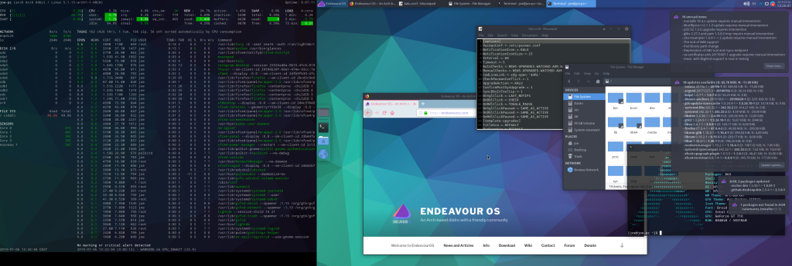

<link rel="stylesheet" type="text/css" href="styles.css">

# Endeavour OS
### 1- Distribution History

- When the popular Arch-based distro Antergos ended
its run in May 2019, it left a friendly and extremely helpful community behind.
Within a matter of days after the announcement, Bryan Poerwoatmodjo opted for
the idea to continue the community feeling on a new forum that would invite any
Arch or Arch-based Linux user into the group. The idea received a lot of
enthusiastic response, more than enough for him to get the project going.

- Quickly, Johannes Kamprad, Fernando Omiechuk Frozi and
Manuel joined him to set up the project and when that happened, the plan changed
from preserving the former community on a new forum to creating a new distro
with that vibrant community at its core.

 

  

    
    

 

- With the plan to turn Endeavour into EndeavourOS, we deliberately travelled another road than Antergos did. It never was and it will never be our intention to be an Antergos clone. In fact, our departure point was the Antergos community and not Antergos the distro and that’s why we chose to let go of the look and feel of our predecessor and find our own voice in creating our own identity with the community at our side.

 

- To avoid the project becoming unmanageable, we decided in the early stage of development to provide a basic system that is close to Arch Linux. That’s why we are aiming for a Linux user with an intermediate level of knowledge who likes to handle a system that needs hands-on customization from the get-go, with the help of our main standout feature: Our vibrant and friendly community.

First release and a snapshot of the original website

- This resulted in a distro that is lightweight and ships with a minimum amount of preinstalled apps. An almost blank canvas ready to personalize.

- Flavors:
  - KDE
  - GNOME
  - Xcfe4
  - Cinnamon
  - Mate
  - Budgie
  - LXQT
  - LXDE
  - i3-wm
  
  
---
### References
- [EndeavourOS site](https://endeavouros.com/)

### 2- Intended Users
- Use cases:
  - Users who have some experience with Linux and are comfortable with tasks such as manual system configuration, command-line usage, and troubleshooting.
  - Users who are comfortable to use arch-based distro and know how to use pacman and Arch User Repository (AUR) but with user-friendly interface.
- Cases where don't use this distro:
  - Endeavour OS is not for servers because it is Rolling Release Model.
  - If you are new to linux, Endeavour OS may be not comfortable for you. 
